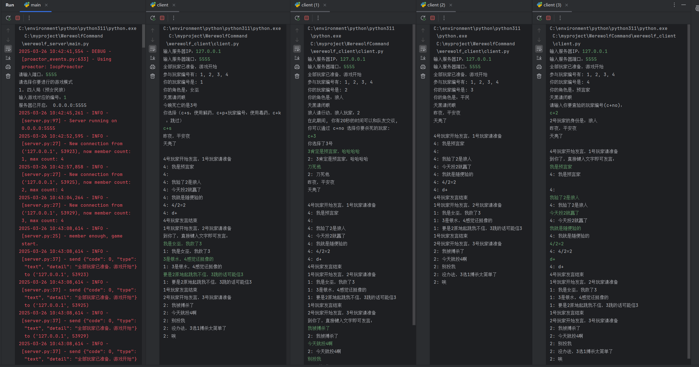
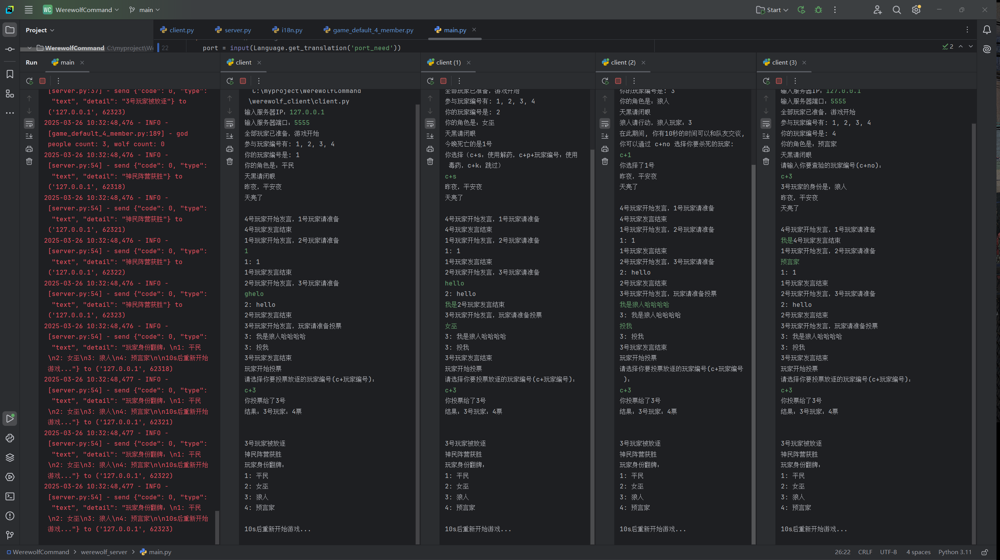

# WerewolfCommand

这是一个基于命令行的狼人杀游戏，玩家可以在终端中体验经典的狼人杀游戏玩法。游戏支持多名玩家并包含多种角色，旨在提供一个有趣的社交游戏体验。

## 功能特点

- 可以支持多个玩家
- 经典角色配置（狼人、村民、预言家等）
- 轮流进行的游戏阶段（夜晚和白天）
- 方便的命令行界面与操作，方便摸鱼游玩
- 开放源代码，可扩展与修改

## 环境要求

- Python 3.11 及以上版本
- 终端或命令行界面

## 安装

1. 克隆项目到本地：
   ```bash
   git clone https://github.com/waterisblue/WerewolfCommand.git
   ```

2. 进入项目目录：
   ```bash
   cd WerewolfCommand
   ```

3. 安装依赖：
   ```bash
   pip install -r requirements.txt
   ```

## 游玩方法

在命令行中运行游戏服务端：

```bash
  python werewolf_server/main.py
```

在命令行中运行游戏客户端：

```bash
  python werewolf_client/main.py
```

按照屏幕提示进行操作，你将可以选择加入游戏、选择角色以及参与投票等。

## 角色介绍

- **狼人**：每晚选择一名玩家击杀。
- **村民**：没有特殊能力，白天进行投票。
- **预言家**：每晚可以查验一名玩家的身份。
- **女巫**：每晚可以毒杀或救活一名玩家。

（根据实际游戏角色进行修改）

## 模式

- **四人标准场**：预言家、女巫、村民、狼人，无警徽、无死亡发言、屠城局。
- **八人标准场（开发中）**：预言家、女巫、猎人、村民（2）、狼人（3）、无警徽、屠城局。
## 贡献

欢迎任何形式的贡献！如果你有改进的建议或发现了错误，欢迎提交问题（Issue）或拉取请求（Pull Request）。

欢迎添加新角色和对局！角色和对局模板已生成，可以直接套用。

## 许可证

该项目使用 MIT 许可证，详情请参考 [LICENSE](LICENSE)。

## 联系

感谢你的参与，希望你能享受这个游戏！
```
mail: 1772756410@qq.com
```

# 展示图



